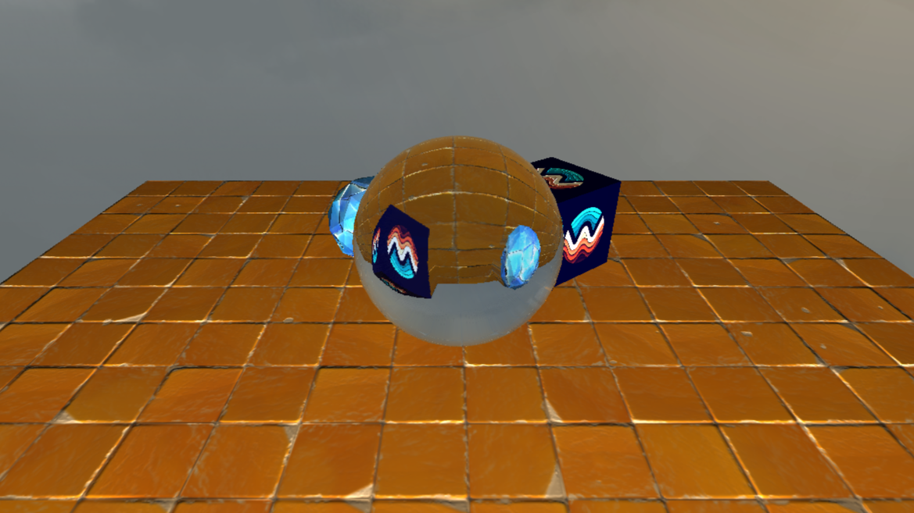

# Glass Shader Demo

This demo showcases screen space glass refraction for any convex mesh, and also works effectively for many concave meshes.

## Controls:

### Movement

**Right Mouse Button:** Enable camera Controls

**W/S/A/D/E/Q:** Move camera

### Demo

**Space:** Change glass to use next mesh

**Enter:** Toggle follow camera mode

**P:** Place mesh in world

**O:** Delete last placed mesh

**Up/Down Arrow:** Move mesh away from/towards camera

**Right/Left Arrow:** Scale mesh up/down

**R/G/B/F:** Increase the Red/Green/Blue/Absorption factor

**>/<:** Increase/decrease the index of refraction

### Controls with SHIFT held:

**Space:** Change glass to previous mesh

**Up/Down Arrow:** Rotate mesh around X axis

**Right/Left Arrow:** Rotate mesh around Y axis

**R/G/B/F:** Decrease the Red/Green/Blue/Absorption factor

### Controls with CTRL held (while not in camera follow mode):

**Up/Down Arrow:** Move mesh up/down

**Right/Left Arrow:** Move mesh left/right

### Graphics:

**Numbers 1-9:** Set max number of loop iterations in ray casting to 100-900

**I:** Toggle Render with internal reflections